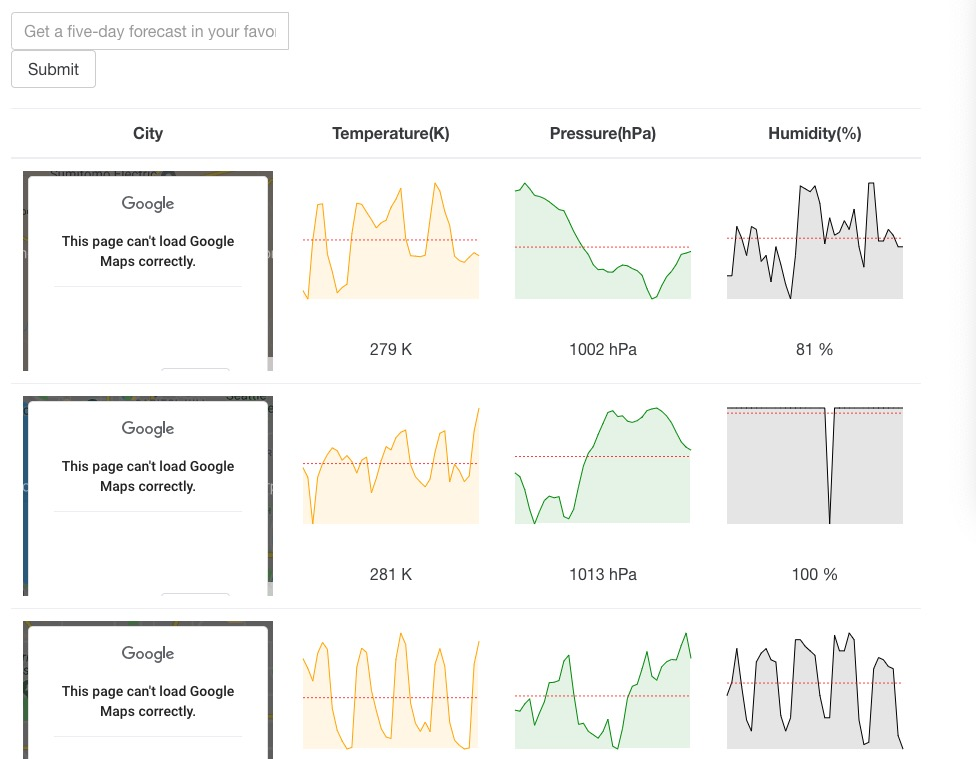

A website you can search forcast of city, then it will display chart shows map of city(not shown right now since googlemap api not free anymore:( ), temperature, pressure, humidity

## Available Scripts
In the project directory, you can run:
### `npm install` 
install node modules
### `npm start`
start the application

